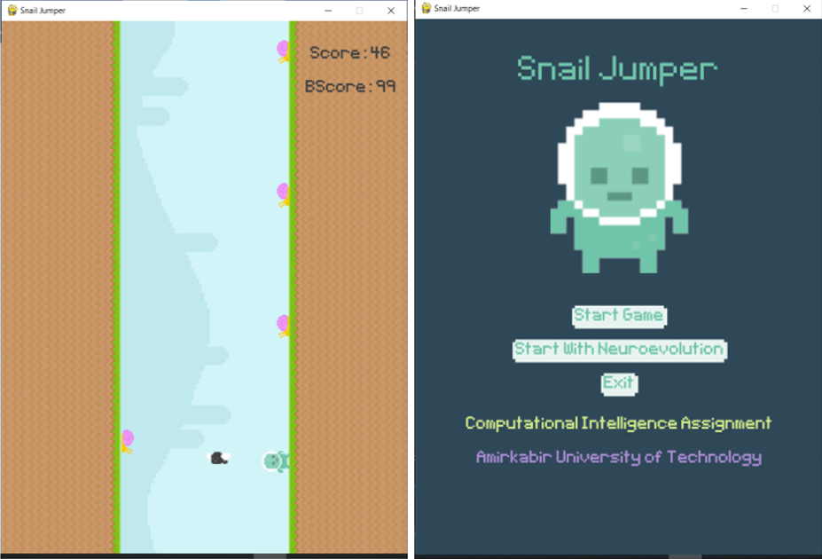

# Snail jumper
This is the neuroevolution project for the Computational Intelligence courese at the Amirkabir University of Technology.

* Roulette wheel, SUS and Q-tournament algorithms are implemented for selecting the next generation and generating a new population.

The full description of the project in Persian is available in the [description file](description.pdf).

